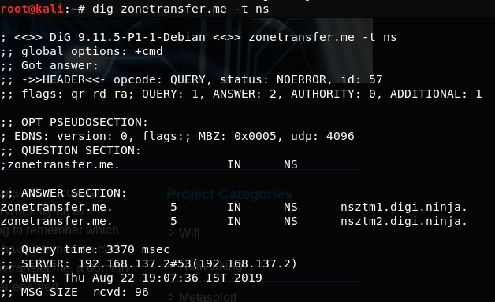
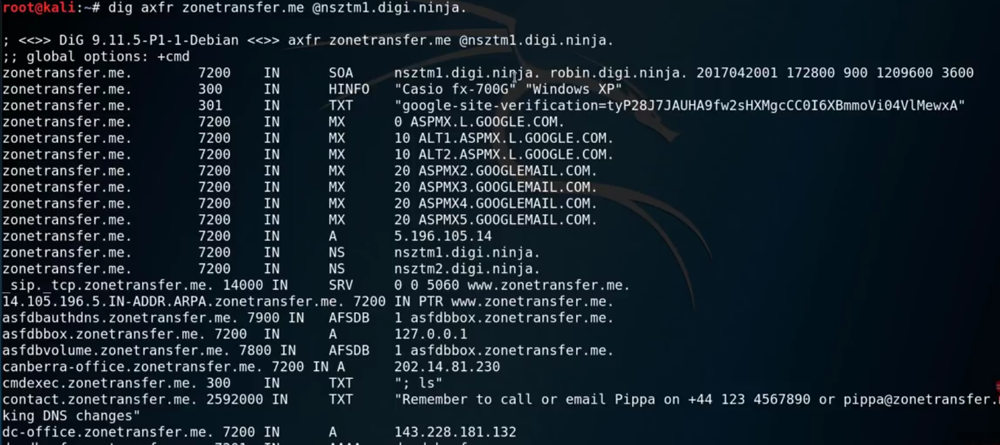
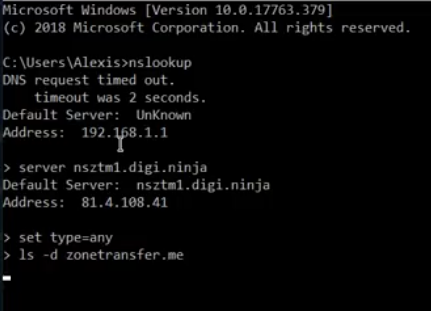

# 3.1.1.2 DNS Zone Transfer

Link : [https://digi.ninja/projects/zonetransferme.php](https://digi.ninja/projects/zonetransferme.php)

Tutorial link : [https://www.youtube.com/watch?v=kdYnSfzb3UA](https://www.youtube.com/watch?v=kdYnSfzb3UA)

Given the zone transfer is enabled \(due to misconfiguration\)

## Introduction to DNS Zone tranfers

* Know all name server address \(NS\)
  * `host -t ns megacorpone.com`
* Know all mail server addresses \(MX\)
  * `host -t mx megacorpone.com`
* `host megacorpone.com` vs `host www.megacorpone.com`
  * We have specified a protocol in 2nd case "www" means http. Whereas in the first case we do not specify anything.
* A zone transfer could only be possible between any one of the name servers of a domain. Zone transfer is just replicating DNS data. The zone transfer did is from "megacorpone.com" to "ns2.megacorpone.com". And while transferring it dumps/prints out all the DNS records copied.
* A zone transfer is similar to that of a cluster consisting of a primary DNS server and a secondary DNS server. 
* Lets say we have some issues with our primary DNS server, to solve the problem, we do a zone transfer.
* This transfers the control over to the secondary DNS server. During this action, all the DNS entries are update to the secondary DNS server, which is output to the standard output.
* Not all DNS servers could be zone transfered. Only valid ones should be allowed to do so. But due to misconfiguration we may exploit this fault and gather more information of the DNS record and internal IPs of the organization.

## Checking if the NS is vulnerable to Zone Transfer

This is not the actual zone transfer attack, we are first checking if could perform the zone transfer for the given NS.

### Example 1- Using "host" : yes vulnerable

### Example 2- Using "dig" : yes vulnerable

## Performing Actual Zone transfer

### Example 1 - Using "dig"

### Example 2- Using nslookup

